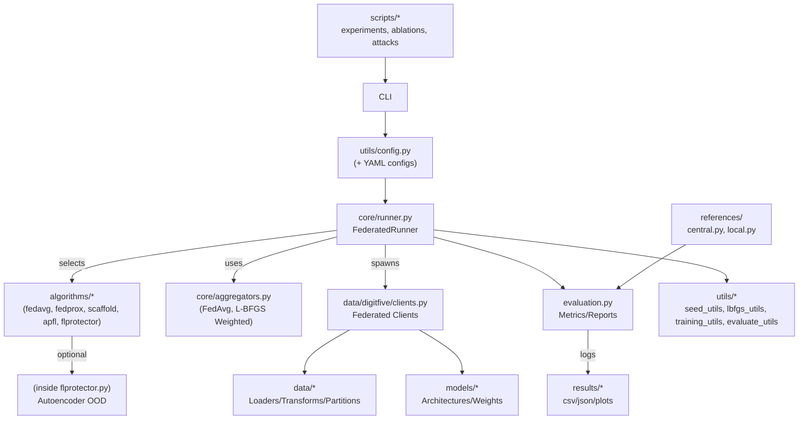

<!--
SPDX-FileCopyrightText: 2025 Roi Martínez Enríquez
SPDX-License-Identifier: Apache-2.0
-->

# FLProtector: Out-of-Distribution Detection and Adaptive Interpolation for Personalized Federated Learning

This repository implements **FLProtector**, the Personalized Federated Learning framework introduced in:

> **Análise de estratexias de aprendizaxe federada robustas a datos heteroxéneos**  
> Roi Martínez, Roberto Iglesias, Francisco Javier García  
> *Traballo de fin de Máster Universitario en Tecnoloxías de Análise de Datos Masivos: Big Data*  
> [Memoria-TFM.pdf](Memoria-TFM.pdf)

> **Out of Distribution Detection and Adaptive Interpolation for Personalized Federated Learning**  
> José Miguel Burés, Roi Martínez, Alfonso Núñez, Roberto Iglesias, Xosé Ramón Fernández, Francisco Javier García  
> *ECAI 2025*  
> [Open Access PDF (IOS Press)](https://doi.org/10.3233/FAIA251020)

---

## 🧩 Overview

**FLProtector** is a dual-model federated learning framework designed to dynamically adapt between global and local knowledge in heterogeneous environments.  
Each client maintains:
- a **global model**, shared across all clients, and  
- a **personalized increment**, co-evolved with the global model.

At inference time, a **client-specific autoencoder** detects out-of-distribution inputs and decides whether to use the global or local model.  
Additionally, aggregation is performed using **gradient-consistency weighting**, leveraging L-BFGS approximations to reduce the impact of inconsistent clients.

---

## 🏗️ Software Architecture




The current implementation follows a modular design that separates the orchestration logic of the federated process from the algorithmic definitions, data management, and evaluation routines.  
This modularity enables new methods to be integrated without altering the core infrastructure, facilitating reproducibility and comparative experimentation.

### 1. Core Layer — Execution Engine (`src/pfl_benchmark/core/`)

The **core** module defines the central engine that manages the full lifecycle of federated training and aggregation.

- **`runner.py`**  
  Implements the `FederatedRunner`, which orchestrates global rounds, model distribution, local training, and result aggregation.  
  It provides hooks for round initialization, logging, and evaluation.  
  The runner is algorithm-agnostic and interacts dynamically with any algorithm defined under the `algorithms/` module.

- **`aggregators.py`**  
  Defines the aggregation mechanisms applied at the server level.  
  The current version supports:
  - **FedAvg**: standard weighted averaging based on client dataset size.  
  - **L-BFGS Weighted**: gradient-based reweighting using L-BFGS curvature approximations.

---

### 2. Algorithm Layer — Federated Learning Methods (`src/pfl_benchmark/algorithms/`)

Each algorithm is implemented as an independent module following a shared interface for training, evaluation, and communication with the runner.

- **`fedavg.py`** — Standard *Federated Averaging* baseline.  
- **`fedprox.py`** — Extends FedAvg with a proximal term to mitigate client drift.  
- **`scaffold.py`** — Implements *control variates* for variance reduction at both client and server levels.  
- **`apfl.py`** — Supports adaptive interpolation between local and global models.  
- **`flprotector.py`** — Introduces *FLProtector*, a dual-model framework with:  
  - client-specific **autoencoder-based out-of-distribution detection**,  
  - personalized model interpolation, and  
  - aggregation enhanced by **gradient consistency** or **VRed-based weighting**.  

This modular structure allows algorithms to be interchanged or extended without changes to the main federated loop.

---

### 3. Data and Client Layer (`src/pfl_benchmark/data/`)

The data layer defines how datasets and clients are represented and accessed during training.

- **`digitfive/clients.py`** — Encapsulates the behavior of each federated client, including data partitioning, local training, and evaluation procedures.  
- Domain-specific loaders and transforms standardize input preprocessing across datasets (e.g., normalization, image size alignment).  
- The client logic is generic and parameterized by the chosen algorithm, enabling seamless integration with new methods.

---

### 4. Evaluation Layer (`src/pfl_benchmark/evaluation.py`)

Centralized evaluation routines for local and global models.  
The module:
- Computes round-based metrics (accuracy, loss, divergence).  
- Aggregates local and global results for fair cross-algorithm comparison.  
- Supports output in CSV or JSON formats for reproducibility.  
The evaluation layer ensures consistency in performance reporting across all algorithms.

---

### 5. Utility Layer (`utils/`)

This layer provides shared functionality across modules, reducing redundancy and improving maintainability.

- **`config.py`**: Handles configuration loading from YAML files and command-line overrides.  
- **`seed_utils.py`**: Ensures deterministic experiments through controlled seeding.  
- **`training_utils.py`**: Contains reusable primitives for local and global training loops.  
- **`evaluate_utils.py`**: Provides helper functions for evaluation and metric computation.  
- **`lbfgs_utils.py`**: Implements Hessian–vector approximations and curvature-based reweighting used in consistency aggregation.  
- **`file_utils.py` / `init_utils.py`**: Manage experiment directories, checkpoints, and runtime initialization.

These modules serve as infrastructure support for both the core engine and algorithmic extensions.

---

### 6. Experimental and Reference Scripts

- **`scripts/`** — Contains standalone experiment scripts for ablation studies, robustness testing, and variance-reduction analysis.  
  Examples include attack simulations, FLProtector ablations (with or without L-BFGS), and performance diagnostics.  

- **`references/`** — Provides baseline implementations of **centralized** (`central.py`) and **local-only** (`local.py`) training setups to contextualize federated results.

---

### 7. Entry Points and Configuration

The project can be executed either through the main entry script or as a Python module:

```bash
python -m pfl_benchmark --config configs/d5/flprotector.yaml
```

Configuration files define all experiment parameters, including:
- Algorithm and aggregator selection.  
- Model architecture and optimizer settings.   
- Paths for datasets and output directories.  

This configuration-driven design promotes reproducibility and enables batch experimentation.

---

### 8. Design Principles

| Principle | Description |
|------------|-------------|
| **Separation of Concerns** | Orchestration, algorithmic logic, and data management are encapsulated in distinct layers. |
| **Extensibility** | New algorithms or aggregators can be added via subclassing without modifying the runner. |
| **Reproducibility** | All experiments are defined declaratively via YAML and managed through consistent seeding and logging. |
| **Comparability** | Shared evaluation and configuration standards ensure fair benchmarking across methods. |

---

## ⚙️ Installation

```bash
git clone https://github.com/romaren2412/FLProtector.git
cd FLProtector
git checkout main
pip install -r requirements.txt
```

---

## 🚀 Usage Example

This project exposes a Typer-based CLI under the package entry point `pfl_benchmark`. Two commands are available:

- `train`: run a federated experiment from a YAML configuration (with optional inline overrides).
- `final-test`: run stored-model evaluations for a completed run directory (including optional backdoor attack assessment).


### 1) Train from a YAML configuration

```bash
python -m pfl_benchmark train   --config configs/d5/flprotector.yaml
```

Inline overrides are supported for nested fields:

```bash
python -m pfl_benchmark train   --config configs/d5/flprotector.yaml   --override algorithm.num_epochs=25
```

### FLProtector + ablation (no autoencoder or no personalization)
```bash
python -m pfl_benchmark train   --config configs/d5/flprotector.yaml   --override algorithm.name=flprotector   --override algorithm.ablation=no_autoencoder
```

> Allowed values for `algorithm.name`: `fedavg`, `fedprox`, `scaffold`, `apfl`, `flprotector`.  
> Allowed values for `algorithm.ablation` in training: `baseline`, `no_autoencoder`, `no_personalization`, `no_lbfgs` (the latter requires a separate training/test setup without L-BFGS-based weighting).

---

### 2) Final evaluation for a completed run (`final-test`)

`final-test` consumes the **run directory** produced by a previous `train` execution. It can run standard evaluation (FLProtector only) or a **backdoor attack** assessment.

**(a) Standard final test (FLProtector only):**
```bash
python -m pfl_benchmark final-test   --run-dir output_folder/   --ablation-mode baseline
```

**(b) Backdoor attack evaluation (any trained run with stored models):**
```bash
python -m pfl_benchmark final-test   --run-dir output_folder/   --attack backdoor   --target-label 0
```

Notes:
- `--ablation-mode` accepts: `baseline`, `no_autoencoder`, `no_personalization`.  
- The special value `no_lbfgs` is **not** accepted by `final-test`; it must be handled by an **independent** training/evaluation pipeline configured without L-BFGS weighting.
- When `--attack backdoor` is used, results are saved to `final_test_backdoor.json` under the provided `--run-dir`.  
- `final-test` **without** `--attack` is only available for runs trained with **FLProtector**. Other algorithms would give the same results as the final test epoch in training execution.


---

## 📦 Dataset Setup

The experiments require the **Digit-Five (D5)** dataset, which contains all domain data preprocessed into multiple `.mat` files.

### 🔗 Download

You can obtain the full dataset archive from the following link:

👉 [Download D5 dataset (external source)](https://nubeusc-my.sharepoint.com/:u:/g/personal/roi_martinez_usc_es/EeAZswgYL35DlMDMMLT2ISYBXxn7A_8yOgX3d6VsQbIUJQ?e=JSmzac)

After downloading, extract the contents so that the folder structure looks as follows:

```
project_root/
│
├── data/
│   └── d5/
│       ├── data_0.mat
│       ├── data_1.mat
│       ├── data_2.mat
│       ├── ...
│       ├── data_210.mat
│       └── data_211.mat
│
├── src/
└── ...
```

In other words, you should have all `.mat` files placed under:
```
~/data/d5/
```

Each `.mat` file contains a preprocessed data split used by the loaders within the benchmark.

### Tips
- Do **not** rename the files — the numeric order is required for proper loading.  
- For more details about dataset licensing and sources, see [`DATA_LICENSES.md`](./DATA_LICENSES.md).

## 🧮 Extending the Framework

You can add new algorithms to the framework without changing the core runner or client logic.  
Each algorithm defines its own training behavior through three main hooks.

### 1. Create a new algorithm file
Add a file under `src/pfl_benchmark/algorithms/`, for example:

```python
# src/pfl_benchmark/algorithms/myalgo.py
class MyAlgo:
    def __init__(self, cfg):
        self.cfg = cfg

    def before_round(self, round_idx, global_state):
        """Optional: run setup before each round."""
        pass

    def client_step(self, client, round_idx):
        """Define how each client trains locally."""
        return client.train_local(epochs=self.cfg["algorithm"]["num_epochs"])

    def server_step(self, client_updates):
        """Define how to combine client updates (aggregation)."""
        return self._aggregate(client_updates)
```

Check existing examples like `fedavg.py` or `flprotector.py` for reference.

---

### 2. Register your algorithm
In `src/pfl_benchmark/utils/init_utils.py`, add your class to the registry:

```python
ALGORITHMS = {
    "myalgo": MyAlgo,
}
```

---

### 3. Configure and run
Create a YAML config (e.g., `configs/d5/myalgo.yaml`):

```yaml
algorithm:
  name: myalgo
  num_epochs: 10
  # custom parameters
```

Then launch it:

```bash
python -m pfl_benchmark train   --config configs/d5/myalgo.yaml   --override algorithm.name=myalgo
```


#### (Optional) Add a custom aggregator
If you need a new server-side rule, define it in `src/pfl_benchmark/core/aggregators.py` and call it inside `server_step`.

---

## 🧾 Citation

If you use this repository, please cite:

```bibtex
@inproceedings{bures2025flprotector,
  title     = {Out of Distribution Detection and Adaptive Interpolation for Personalized Federated Learning},
  author    = {Burés, José Miguel and Martínez, Roi and Núñez, Alfonso and Iglesias, Roberto and Fernández, Xosé Ramón and García, Francisco Javier},
  booktitle = {Proceedings of the 27th European Conference on Artificial Intelligence (ECAI)},
  year      = {2025},
  doi       = {10.3233/FAIA251020}
}
```

---

## 🪪 Reuse & License

This repository follows the [REUSE](https://reuse.software/) best practices:

- License texts are provided in `LICENSES/`.
- File-level SPDX headers declare copyright and license.
- A repository-level `REUSE.toml` defines defaults and exceptions.

You can verify compliance with:

```bash
pip install reuse
reuse lint
```

---

## 📬 Contact

For research inquiries:
- **Roi Martínez** — [roi.martinez@usc.es](mailto:roi.martinez@usc.es)
